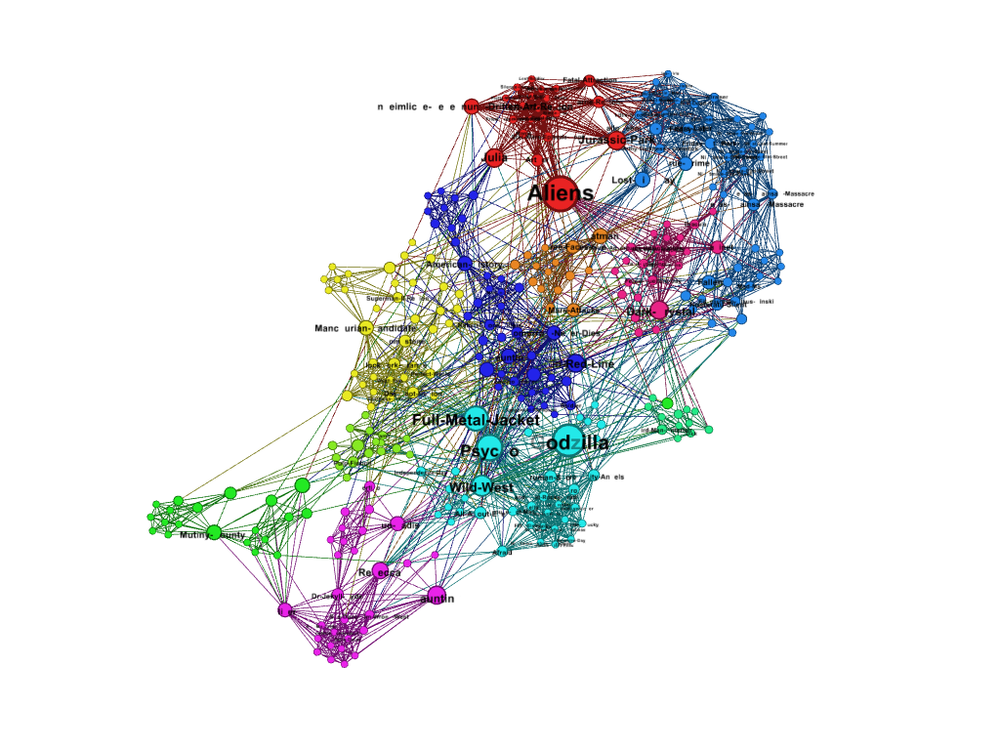
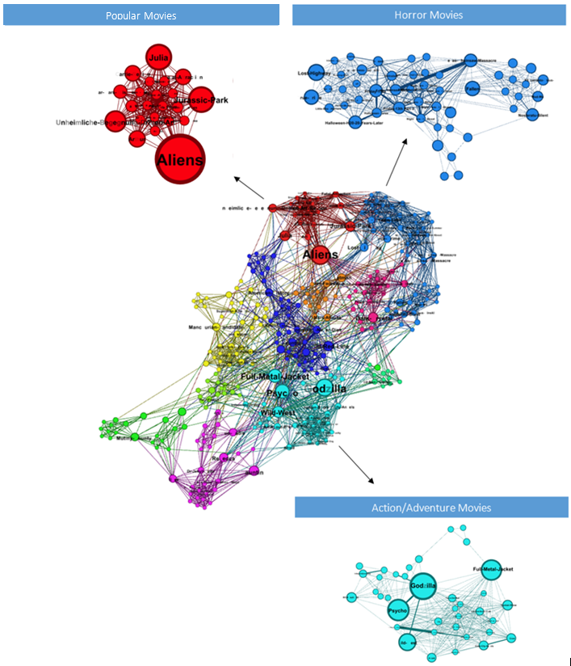
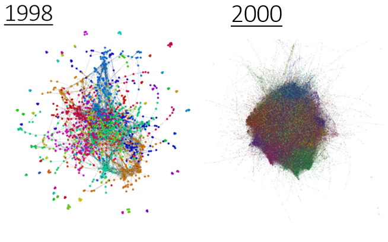
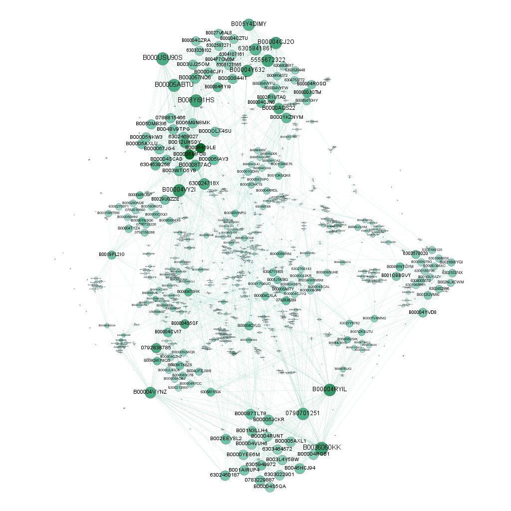
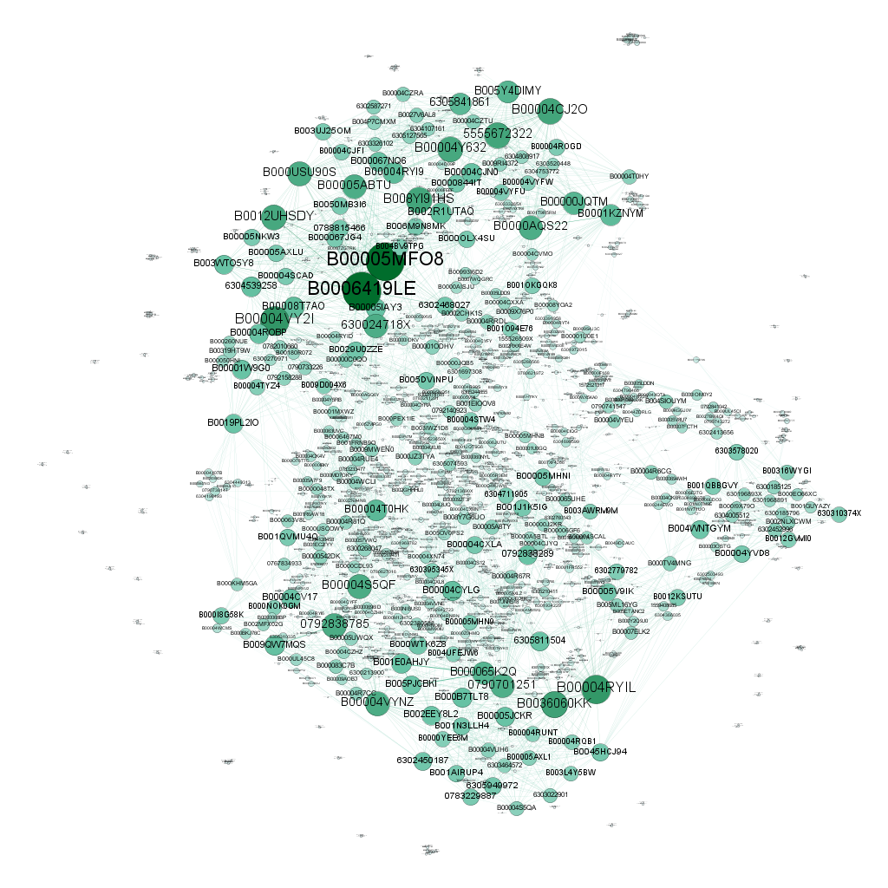
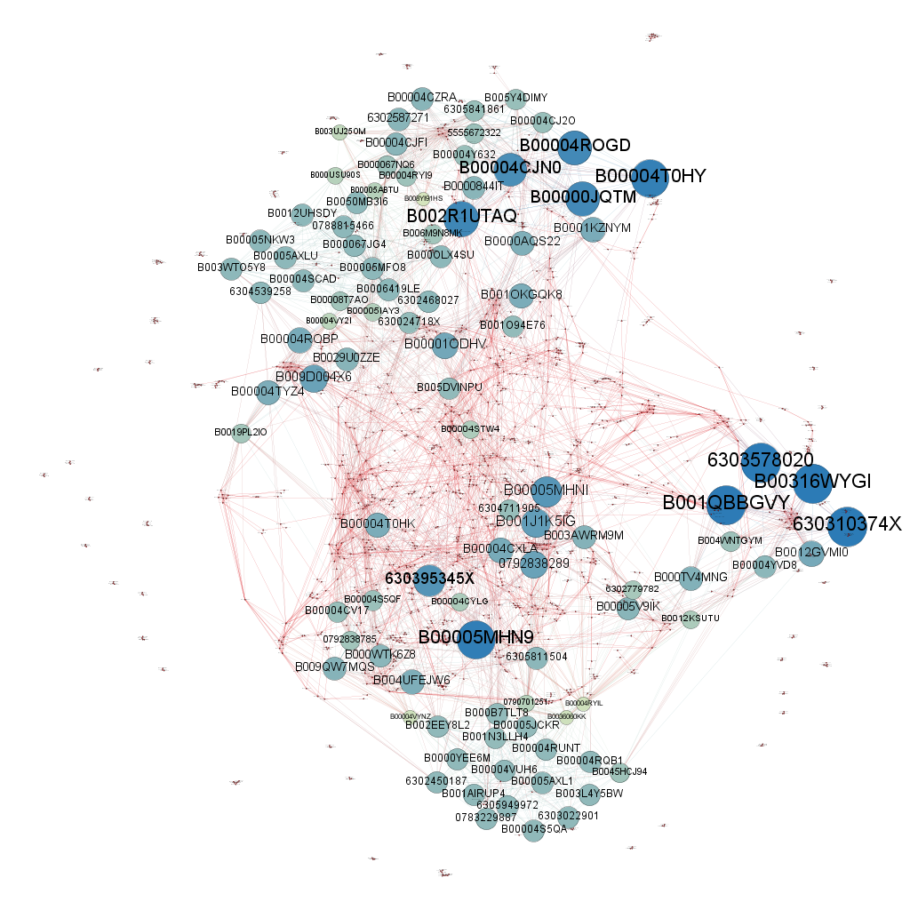
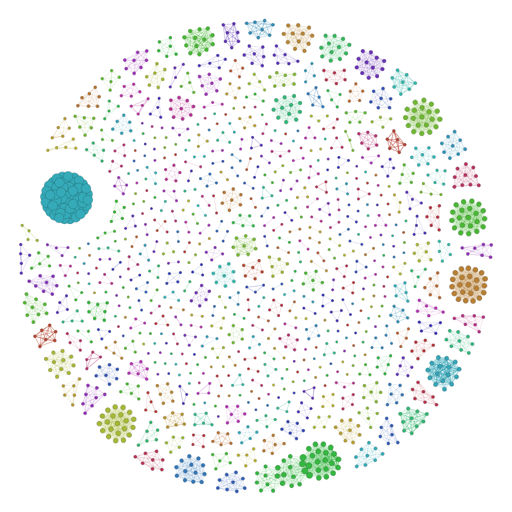
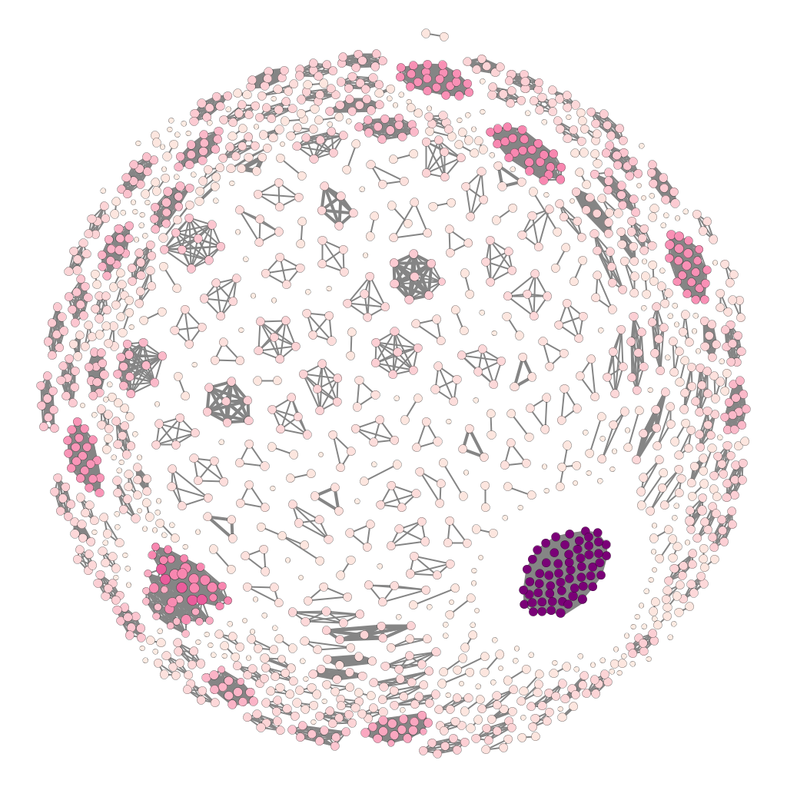

```{r include=FALSE}
library(ggplot2)
source("analyze.R")
projection_Rdata_file <- "data/movie_movie_projection.Rdata"
load(projection_Rdata_file)
descriptive_Rdata_file <- "data/projection_descriptions.Rdata"
load(descriptive_Rdata_file)
```

# 1998 & 2000 Analysis
## Node Edge Counts
```{r echo = F}
summary(projection1998)
```

## Degree Distribution
```{r echo = F}
hist(description_1998$degree_dist,
       main = "Degree Distribution",
       xlab = "Degree",
       breaks = 100,
       col = "blue")
```

The degree distribution shows that most of the movies don't share reviewers with a large number of other movies.

## Degree Strength Distribution
```{r echo = F}
hist(description_1998$degree_strength,
       main = "Degree Strength Distribution",
       xlab = "Degree Strength",
       breaks = 100,
       col = "blue")
```

The degree strength distribution shows that most movies do not receive many reviews from reviewers that also reviewed other movies.

## Eigenvector Centrality Distribution
```{r echo = F}
hist(description_1998$evcentrality,
       main = "Eigenvector Centrality Distribution",
       xlab = "Eigenvector Centrality",
       breaks = 100,
       col = "blue")
```

The eigenvector centrality distribution shows us that few movies are connected by reviewers to several other highly connected nodes. We can see a small spike that represents the few movies that break the trend and have shared reviewers with several other well connected movies.

## Transitivity Distribution
```{r echo = F}
hist(description_1998$transitivity,
       main = "Transitivity Distribution",
       xlab = "Transitivity",
       breaks = 100,
       col = "blue")
```

The spike in the transitivity distribution at 1 shows us that most of the neighbor movies are tightly connected. Due to the low degree of the network, these cliques are fairly small.

# 2000 Analysis
## Node Edge Counts
```{r echo = F}
summary(projection2000)
```

## Degree Distribution
```{r echo = F}
hist(description_2000$degree_dist,
       main = "Degree Distribution",
       xlab = "Degree",
       breaks = 100,
       col = "blue")
```

The degree distribution shows that most of the movies don't share reviewers with a large number of other movies.

## Degree Strength Distribution
```{r echo = F}
hist(description_2000$degree_strength,
       main = "Degree Strength Distribution",
       xlab = "Degree Strength",
       breaks = 100,
       col = "blue")
```

The degree strength distribution shows that most movies do not receive many reviews from reviewers that also reviewed other movies.

## Eigenvector Centrality Distribution
```{r echo = F}
hist(description_2000$evcentrality,
       main = "Eigenvector Centrality Distribution",
       xlab = "Eigenvector Centrality",
       breaks = 100,
       col = "blue")
```

The eigenvector centrality distribution shows us that few movies are connected by reviewers to several other highly connected movies. There are more highly connected movies in this data set than in the 1998-2000 set.

## Transitivity Distribution
```{r echo = F}
hist(description_2000$transitivity,
       main = "Transitivity Distribution",
       xlab = "Transitivity",
       breaks = 100,
       col = "blue")
```

The spike in the transitivity distribution at 1 shows us that most of the neighbor movies are tightly connected.

# Compairison of 1998-1999 vs First 2000
## Degree Distribution Compairison
```{r echo = F}
degree_dist_join <- data.frame(year = 1998,
                                   degree = description_1998$degree_dist)
degree_dist_join <- rbind(degree_dist_join,
                              data.frame(year = 2000,
                                         degree = description_2000$degree_dist))
degree_dist_join$year <- as.factor(degree_dist_join$year)

ggplot(data = degree_dist_join, 
       aes(x = log(degree), y=..density.., fill = year)) +
  geom_histogram(position="identity",
                 colour = "black",
                 binwidth=.5,
                 alpha=0.4) +
   xlab("Log(Degree)") +
   ylab("Density") +
   ggtitle("Degree Density Compairison")
```

The degree distribution of the 2000 data set has a much longer fatter tail, meaning more movies that have high degree.

## Degree Strength Distribution Compairison
```{r echo = F}
degree_strength_join <- data.frame(year = 1998,
                                   strength = description_1998$degree_strength)
degree_strength_join <- rbind(degree_strength_join,
                              data.frame(year = 2000,
                                         strength = description_2000$degree_strength))
degree_strength_join$year <- as.factor(degree_strength_join$year)

ggplot(data = degree_strength_join, 
       aes(x = log(strength), y=..density.., fill = year)) +
  geom_histogram(position="identity",
                 colour = "black",
                 binwidth=.5,
                 alpha=0.4) +
   xlab("Log(Degree Strength)") +
   ylab("Density") +
   ggtitle("Degree Strength Density Compairison")
```

The degree strength distribution of the 2000 data set has a much longer fatter tail, meaning more movies that have more shared reviewers.

## Eigenvector Centrality Distribution Compairison
```{r echo = F}
evcent_dist_join <- data.frame(year = 1998,
                                   evcent = description_1998$evcentrality)
evcent_dist_join <- rbind(evcent_dist_join,
                              data.frame(year = 2000,
                                         evcent = description_2000$evcentrality))
evcent_dist_join$year <- as.factor(evcent_dist_join$year)

ggplot(data = evcent_dist_join, 
       aes(x = log(evcent), y=..density.., fill = year)) +
  geom_histogram(position="identity",
                 colour = "black",
                 binwidth=.5,
                 alpha=0.4) +
   xlab("Log(Eigenvector Centrality)") +
   ylab("Density") +
   ggtitle("Eigenvector Centrality Density Compairison")
```

The eigenvector centrality distribution of the 2000 data set is shifted higher than the 1998-2000 data set. This is in line with the increased degree of this data set.

## Transitivity Distribution Compairison
```{r echo = F}
transitivity_dist_join <- data.frame(year = 1998,
                                   transitivity = description_1998$transitivity)
transitivity_dist_join <- rbind(transitivity_dist_join,
                              data.frame(year = 2000,
                                         transitivity = description_2000$transitivity))
transitivity_dist_join$year <- as.factor(transitivity_dist_join$year)

ggplot(data = transitivity_dist_join, 
       aes(x = transitivity, y=..density.., fill = year)) +
  geom_histogram(position="identity",
                 colour = "black",
                 binwidth=.1,
                 alpha=0.4) +
   xlab("Log(Transitivity)") +
   ylab("Density") +
   ggtitle("Transitivity Density Compairison")
```

The transitivity of the 2000 data set is slightly shifted higher, meaning that the network is forming more tightly connected groups.

# Network Plots
## Production Quality Plots
### 1998 - 2000 Projection of Movie Reviews
Movie Nodes are sized by betweeness, edges represent shared movie reviewers reviews durring the years of 1998 & 1999. Movies that were not able to be connected to other movies by reviewers were not considered. Movie data had to be deduplicated to eliminate movie variations of the same content (DVD/VHS ...)


### Sub-networks of 1998 - 2000 Movie Reviews
Breaks out of graphs of the 1998 - 2000 data. Groups formed by modularity. Sizing and filtering same as previous.


### Compairison between 1998 - 2000 & 2000
Plot of the 1999-2000 projection, next to the projection of movie reviews taken from the year 2000. Isolates removed. Notice the large increase in movies and edges.


## Exploration Plots
### Plots with Movie ID's
Due to the large number of movies, in the early exploration we looked at graphs like these then looked up ID's -> Movies

**1998 - 2000 Sized & Colored by # of Triangles Formed**


**1998 - 2000 Sized & Colored by Degree Strength**


**1998 - 2000 Sized & Colored Closeness**


### Clusters formed by Duplicated Movie Data
This graph is of the year 1998 only. We found that the clusters were due to movies being duplicated in the data with the same revies.

**Layout 1**


**Layout 2**



